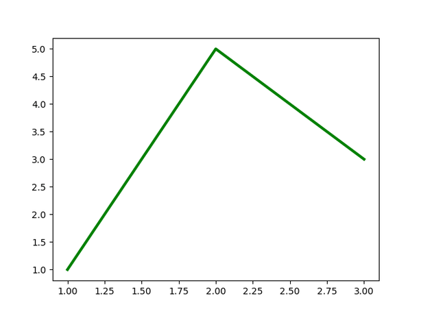

# `snaplot`: record your plot process

`snaplot` is here to help your record your (matplotlib) plotting process, without having to think about it, and do things like:


<br><br>

## Why

By nature, data visualization is an **iterative process**: no one creates the final, perfectly polished version of a graph on the first try. It always takes plenty of **trial and error**. And interestingly, visualizing this process can be quite insightful. That's where snaplot comes in.

<br><br>

## How to use

```python
import matplotlib.pyplot as plt
from snaplot import Camera

camera = Camera.start()

fig, ax = plt.subplots()
ax.plot([1, 2, 3], [1, 2, 3])  # first chart
camera.snap()

fig, ax = plt.subplots()
ax.plot([1, 2, 3], [4, 2, 3], color="red")  # second chart
camera.snap()

fig, ax = plt.subplots()
ax.plot([1, 2, 3], [1, 5, 3], color="green", lw=3)  # third chart
camera.snap()

fig, ax = plt.subplots()
ax.plot([5, 2, 4], [2, 3, 3], color="blue", lw=6)  # fourth chart
camera.snap()

camera.stop("my_file.gif", frame_duration=300)
```



For more info, check out the [reference page](https://y-sunflower.github.io/snaplot/camera/)

<br><br>

## Some cool things

- You can run `Camera.start()` multiple times without forgetting previous `camera.snap()`. Unless you set `force_new=True`, it will automatically recognize that you're still recording.
- Even after calling `camera.stop("file.gif")`, you can keep recording. If you want to save the intermediate GIF, just use a different filename like `camera.stop("file2.gif")`.
- It works with any matplotlib-based plotting library: seaborn, plotnine, etc
