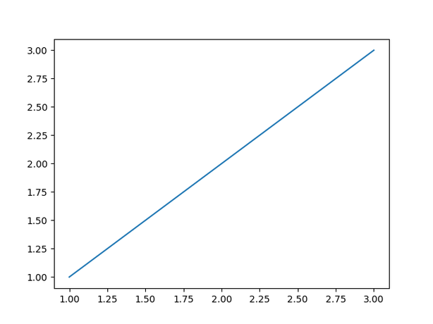

<div class="hero">
   <h1>
      <code class="snaplot">snaplot</code>
      <br/>
      Record and replay every step of your plotting process
   </h1>
</div>

<div class="gif"></div>


`snaplot` is a **Python package** here to help your **record your plotting process**, without having to think about it!

It's highly inspired by [{camcorder}](https://github.com/thebioengineer/camcorder), an R package that does pretty much the same thing. If you're an R user, check it out!

## Why?

By nature, data visualization is an **iterative process**: no one creates the final, perfectly polished version of a graph on the first try. It always takes plenty of **trial and error**.

Interestingly, visualizing this process can be quite insightful. That's where `snaplot` comes in.

## How to use?

`snaplot` provides a single class (`Camera`) and is designed to be as easy-to-use as possible.

```python
import matplotlib.pyplot as plt
from snaplot import Camera

camera = Camera.start("my_movie")

# Step 1 — basic line
fig, ax = plt.subplots()
ax.plot([1, 2, 3], [1, 2, 3])
camera.snap()

# Step 2 — change color
fig, ax = plt.subplots()
ax.plot([1, 2, 3], [1, 2, 3], color="red")
camera.snap()

# Step 3 — increase line width
fig, ax = plt.subplots()
ax.plot([1, 2, 3], [1, 2, 3], color="red", lw=5)
camera.snap()

# Step 4 — add marker
fig, ax = plt.subplots()
ax.plot([1, 2, 3], [1, 2, 3], color="red", lw=5, marker="o")
camera.snap()

# Step 5 — change marker size
fig, ax = plt.subplots()
ax.plot([1, 2, 3], [1, 2, 3], color="red", lw=5, marker="o", markersize=15)
camera.snap()

# Step 6 — add legend
fig, ax = plt.subplots()
ax.plot([1, 2, 3], [1, 2, 3], color="red", lw=5, marker="o", markersize=15, label="cookies")
ax.legend()
camera.snap()

# Step 7 — change axis limits
fig, ax = plt.subplots()
ax.plot([1, 2, 3], [1, 2, 3], color="red", lw=5, marker="o", markersize=15, label="cookies")
ax.set_xlim(0, 4)
ax.set_ylim(0, 4)
ax.legend()
camera.snap()

# Step 8 — add title
fig, ax = plt.subplots()
ax.plot([1, 2, 3], [1, 2, 3], color="red", lw=5, marker="o", markersize=15, label="cookies")
ax.set_xlim(0, 4)
ax.set_ylim(0, 4)
ax.legend()
ax.set_title("Final Look")
camera.snap()

# 8 images, 300ms/image
camera.stop("output.gif", frame_duration=300)
```



In short:

- you initiate a camera with `camera = Camera.start()`
- you take snapshots with `camera.snap()`
- you save your video with `camera.stop()`

For more info, check out the [reference page](./camera.md)

## Installation

```bash
pip install snaplot
```

## Some cool things

- You can run `Camera.start()` multiple times with the same id without forgetting previous `camera.snap()`. Unless you set `force_new=True`, it will automatically recognize that you're still recording.
- Even after calling `camera.stop("file.gif")`, you can keep recording. If you want to save the intermediate GIF, just use a different filename like `camera.stop("file2.gif")`.
- It works with any matplotlib-based plotting library: seaborn, plotnine, etc
